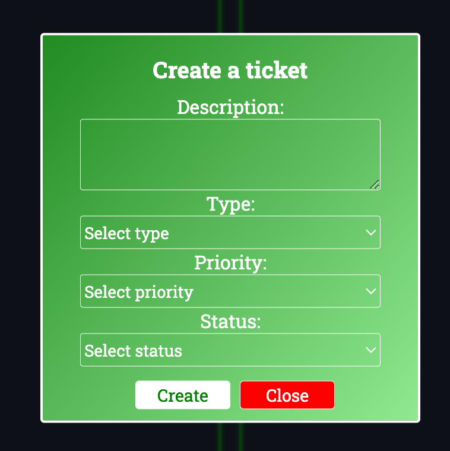
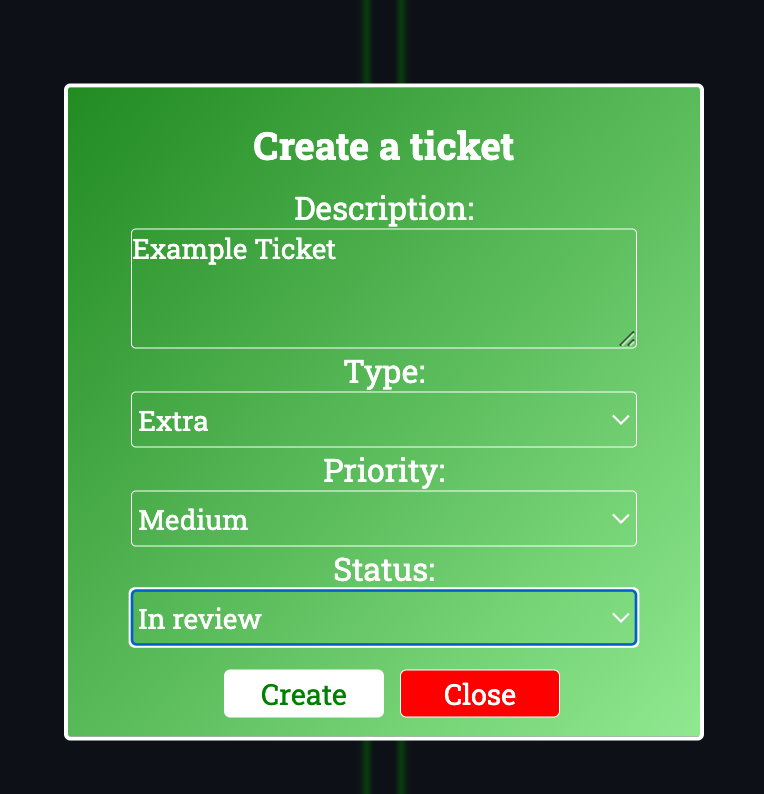
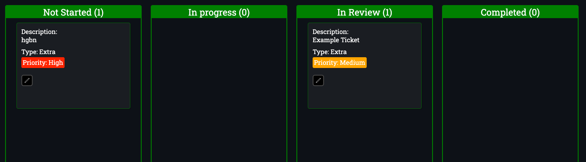
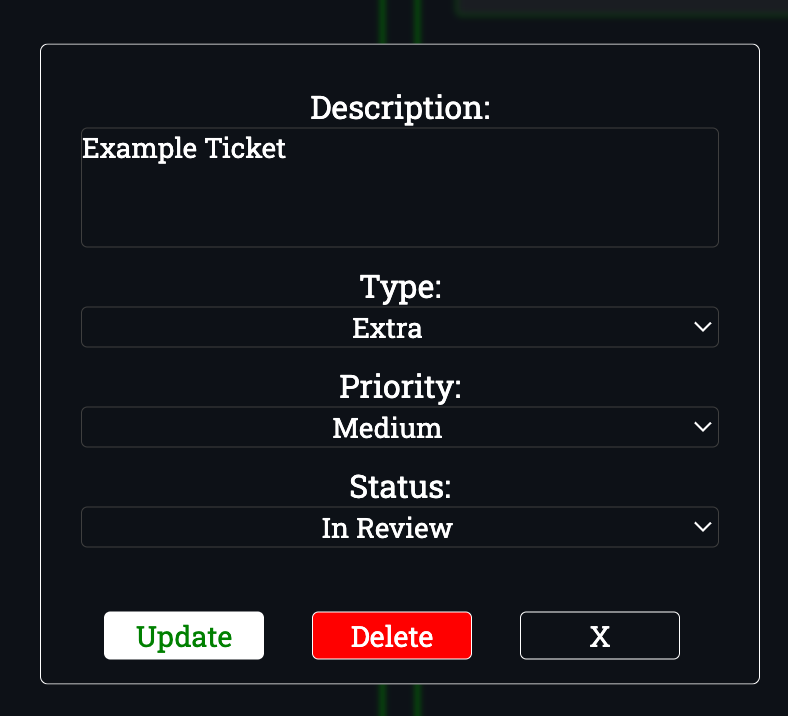

# BugTracker

## Product Overview
BugTrack is a lightweight task and ticket management tool designed to help individuals organise their work clearly through a visual workflow board.

Users can create tasks, assign priorities and move tickets through stages such as 
- **Not Started**
- **In Progress**
- **In Review**
- **Completed**

BugTrack helps users manage tasks visually ensuring work does not get lost, delayed, or forgotten.

## Built with
- Next.js
- CSS
- Vercel
- Local Storage
- React

## Why I Built BugTrack
I built BugTrack to create a clean and simple task management tool that demonstrates front-end development, state management, CRUD functionality, and responsive UI design.

## Features Demonstrated

- CRUD operations  
- Drag and drop functionality  
- Local state management  
- Responsive design  
- Persistent storage using localStorage

## Key Features

### Create Tickets
Quickly log new tasks with clear descriptions.

### Priority Tagging
Assign urgency levels to focus on the most important work first.

### Workflow Columns
Track progress visually across each stage of delivery.

### Edit/Update Tickets
Amend task details as priorities or requirements change.

### Track Progress Visually
Use the board layout to instantly understand workload status.

## Getting Started

Learn how to use BugTrack in under 2 minutes.

## Example Workflow

Try BugTrack here: [BugTrack Live Demo](https://my-kanban-swart.vercel.app/)

### Creating Your First Ticket

Click **Create A Ticket**.

A pop-up form will appear.

Fill in the required details:

- Description  
- Type  
- Priority (High, Medium, Low)  
- Status (In Progress, Not Started, Completed, In Review)

Click **Create** to add the ticket to the Kanban board.

### Move Tickets Through Workflow Stages

To move a ticket to a new stage:

- Click and hold the ticket  
- Drag it into the desired column  
- Release to drop it into place

Updated Kanban board:

### Edit Existing Tickets
To edit a select ticket simply:

- Click on the desired ticket.
- Choose to edit the description, type, priority, status or to delete the ticket

## Workflow Explained 

### Not Started
Tasks that are identified but not yet started.

### In Progress
Tasks that have begun but are not yet complete.

### In Review
Tasks currently under review before completion.

### Completed
Tasks that have been finished and have been marked as complete.

## Best Practices

- Keep tickets clear and concise  
- Use priorities consistently  
- Limit tasks in progress  
- Review tickets regularly  
- Data is stored in local storage, so clearing browser cache will remove tickets
